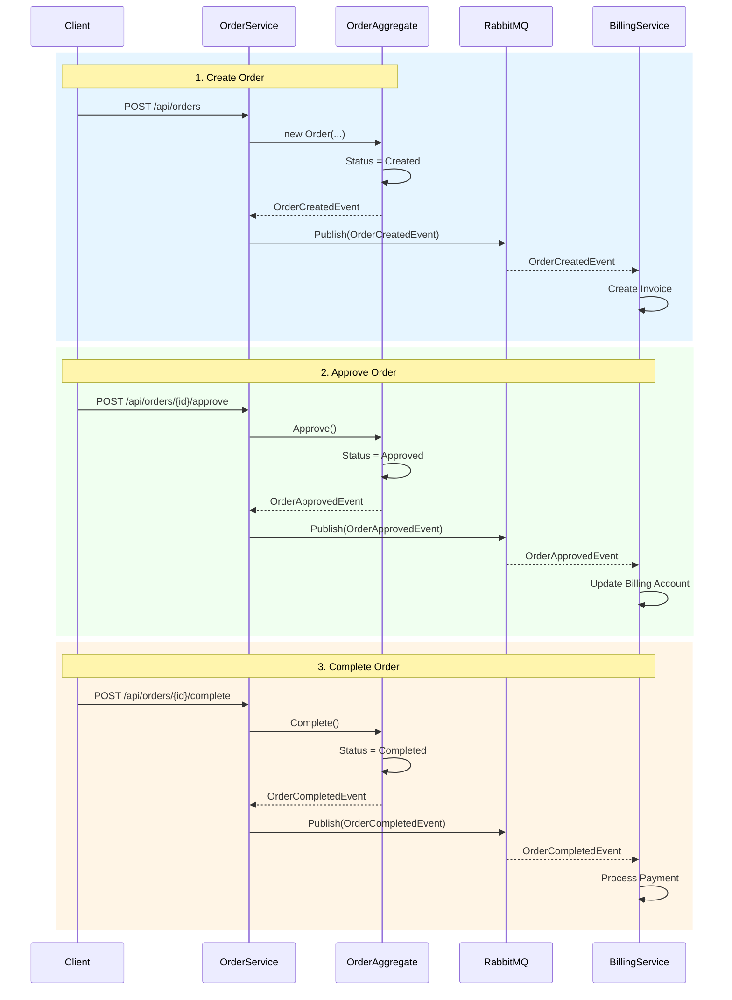

# Shopy - Event-Driven Microservices Platform

## Overview
A .NET 9 event-driven microservices architecture demonstrating Domain-Driven Design (DDD) principles with asynchronous messaging using RabbitMQ.

## Architecture

### Services
- **Order Service** - Manages order lifecycle (Create → Approve → Complete)
- **Billing Service** - Handles invoicing, billing accounts, and payment processing

### Communication
- **Event Bus**: RabbitMQ (fanout exchange pattern)
- **Pattern**: Asynchronous pub/sub messaging
- **Events**: OrderCreated, OrderApproved, OrderCompleted

## Technology Stack
- **.NET 9** - Modern C# with init-only properties and primary constructors
- **RabbitMQ.Client 7.2** - Async message broker
- **System.Text.Json** - Event serialization
- **Docker** - RabbitMQ containerization

## Domain-Driven Design (DDD)

### Order Service 

**Order (Aggregate Root)**
- Enforces business invariants (status transitions: Created → Approved → Completed)
- Raises domain events when state changes occur
- Encapsulates business logic and validates operations

**OrderApplicationService (Application Layer)**
- Orchestrates domain operations (create, approve, complete)
- Publishes integration events to RabbitMQ
- Coordinates cross-cutting concerns (logging, event publishing)

## Key Patterns
- **Aggregate Pattern** - Order enforces invariants, raises events
- **Application Service** - Orchestrates use cases
- **Integration Events** - Cross-service communication via RabbitMQ
- **Event Handlers** - React to events from other services
- **Bounded Contexts** - Each service owns its domain

## Sequence diagram of event flow 

